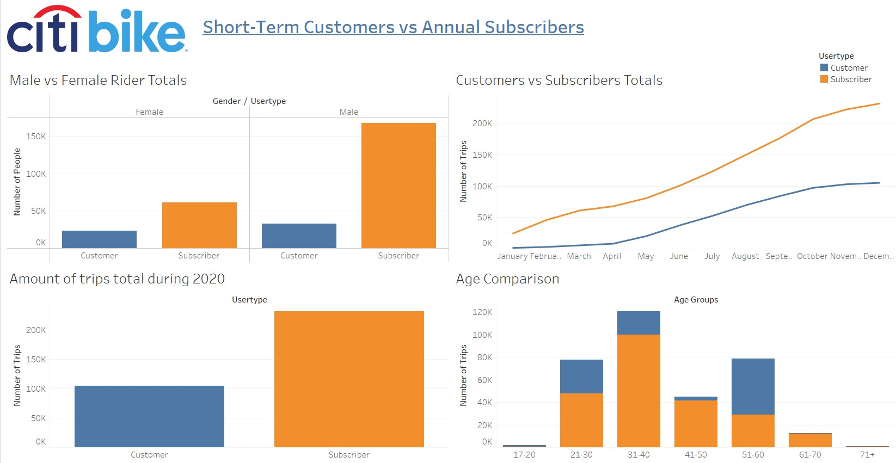
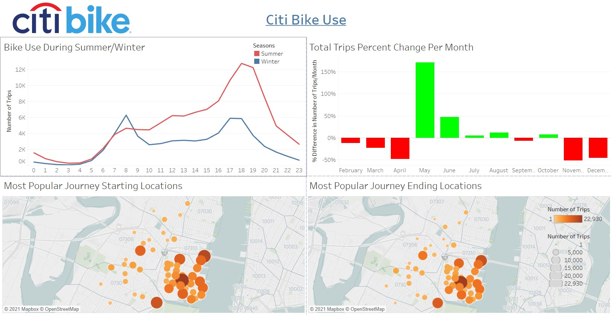
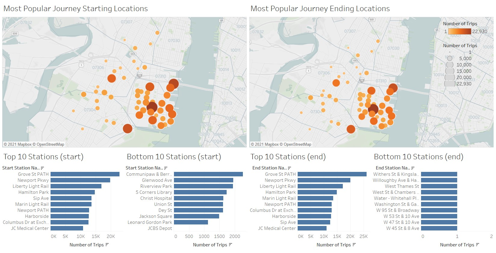

# Citi Bike Analysis

As the new lead analyst for the [New York Citi Bike Program](https://en.wikipedia.org/wiki/Citi_Bike), you are now responsible for overseeing the largest bike sharing program in the United States. In your new role, you will be expected to generate regular reports for city officials looking to publicize and improve the city program.  
Since 2013, the Citi Bike Program has implemented a robust infrastructure for collecting data on the program's utilization. Through the team's efforts, each month bike data is collected, organized, and made public on the [Citi Bike Data](https://www.citibikenyc.com/system-data) webpage.  
However, while the data has been regularly updated, the team has yet to implement a dashboard or sophisticated reporting process. City officials have a number of questions on the program, so your first task on the job is to build a set of data reports to provide the answers.


## Assignment structure
```
project  
|__ images/                              # contains images of graphs created
|
|__ resources/                           # contains raw datasets and combined data
| 
|
|__ citi_bike_analysis_2020.twbx         # tableau file containing analysis
|
|__ data_cleanup.ipynb                   # notebook used to combine and clean datasets
|
|__ README.md                            # readme file
```

## Usage

Dependencies and Setup
```
import pandas as pd
import glob
import os
```
Tableau: https://www.tableau.com/


## Visual Analysis
### Analysing Data from 01/2020 - 12/2020
1. Short-Term Customers vs Annual Subscribers
- Majority of users are males
- There is double amount of subscribers to 

2. CitiBike Use

3. Most/Least Popular Stations
